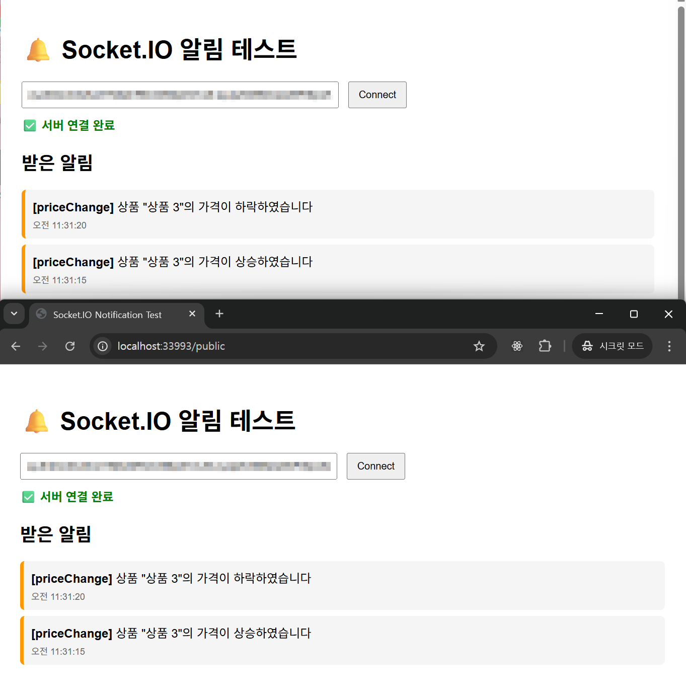
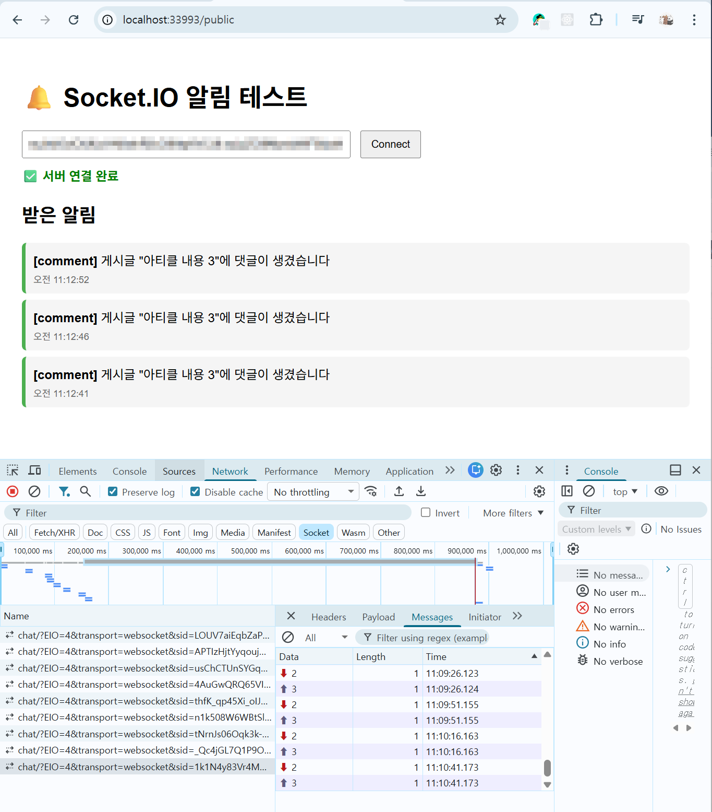
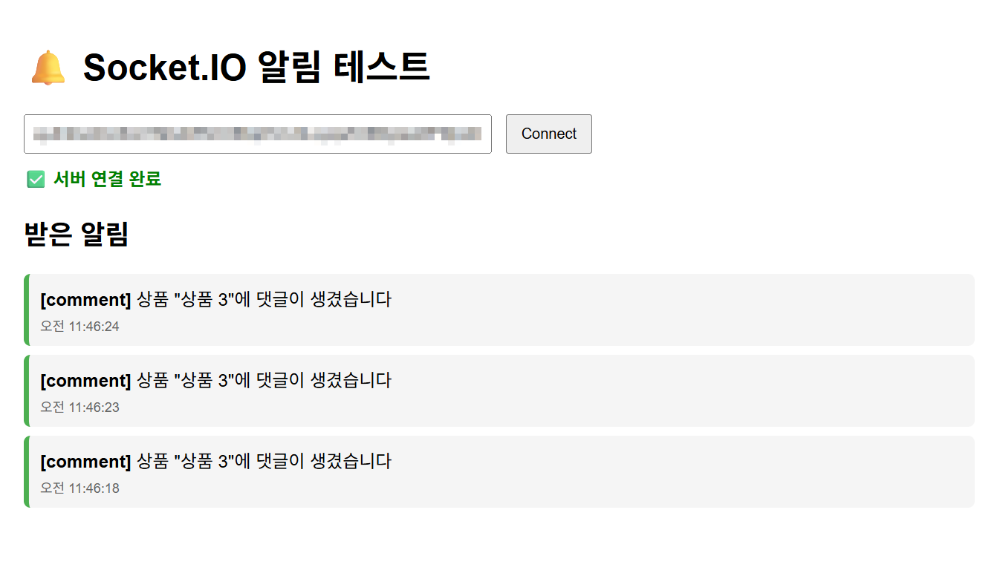

## 요구사항

### [ 목표 ]

- 알림 기능 구현하기
- 웹소켓 또는 Socket.IO를 사용해 실시간 기능 구현하기

### [ 작업 내용 ]

### 1. 알림

- [x] 사용자는 자신의 알림 목록을 조회할 수 있습니다.
- [x] 사용자는 자신의 안 읽은 알림의 개수를 조회할 수 있습니다.
- [x] 사용자는 자신의 알림을 읽음 처리 할 수 있습니다.
- [x] 클라이언트에서는 실시간으로 알림을 받을 수 있습니다.

### 2. 알림 전송

- [x] 좋아요한 상품의 가격이 변동되었을 때 알림을 보내주세요.
      
       
       

- [x] 자신이 작성한 게시글에 댓글이 달렸을 때 알림을 보내주세요.
      

### 2. 심화 요구사항

(없음, 다만 게시글 댓글 알림과 상품 댓글 알림이 유사하여 두가지 모두 구현하였습니다)

    

## 멘토에게

이전 스프린트 미션 5까지 작업한 내용이 모범답안과 너무 차이가 나서 이번 미션 시작 전 모범 답안으로 전체 코드 적용 후 작업하였습니다.
이 점 참고 부탁드립니다 :)
