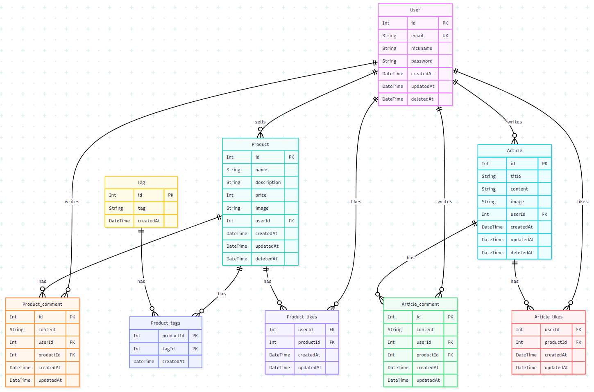

## 요구사항

### [ 목표 ]

- [x] SQL 스키마 설계하기
- [x] ER Diagram 그리기
- [x] SQL 쿼리 작성하기

### [ 작업 내용 ]

### 1. 기본 요구사항

### 1.1. SQL 스키마 설계하기

- [x] "판다마켓 디자인"을 바탕으로 필요한 스키마를 설계
- [x] SQL CREATE TABLE 문법을 사용해 테이블을 생성하는 코드로 설계를 작성
- [x] 작성한 코드를 schema.sql로 저장

### 1.2. ER 다이어그램 그리기

- [x] 설계한 스키마를 바탕으로 ER 다이어그램 제작
- [x] 소프트웨어 도구를 사용 : mermaid.js 사용
- [x] 이미지 파일을 저장 : sprint-mission-7-ERD.png
      

### 1.3. SQL 쿼리 작성하기

- [x] queries.sql 파일의 총 14개의 SQL 쿼리를 작성
- [x] 작업 결과 링크 공유(결과 스크린샷) : https://docs.google.com/presentation/d/14VLnPjW2iUEwBBH1WczB1hlXwwycB2YXuvSt0GxHWw4/edit?usp=sharing

## 멘토에게

- 지난번과 마찬가지로 결과 스크린샷 정리하여 링크로 공유 드립니다 :)
