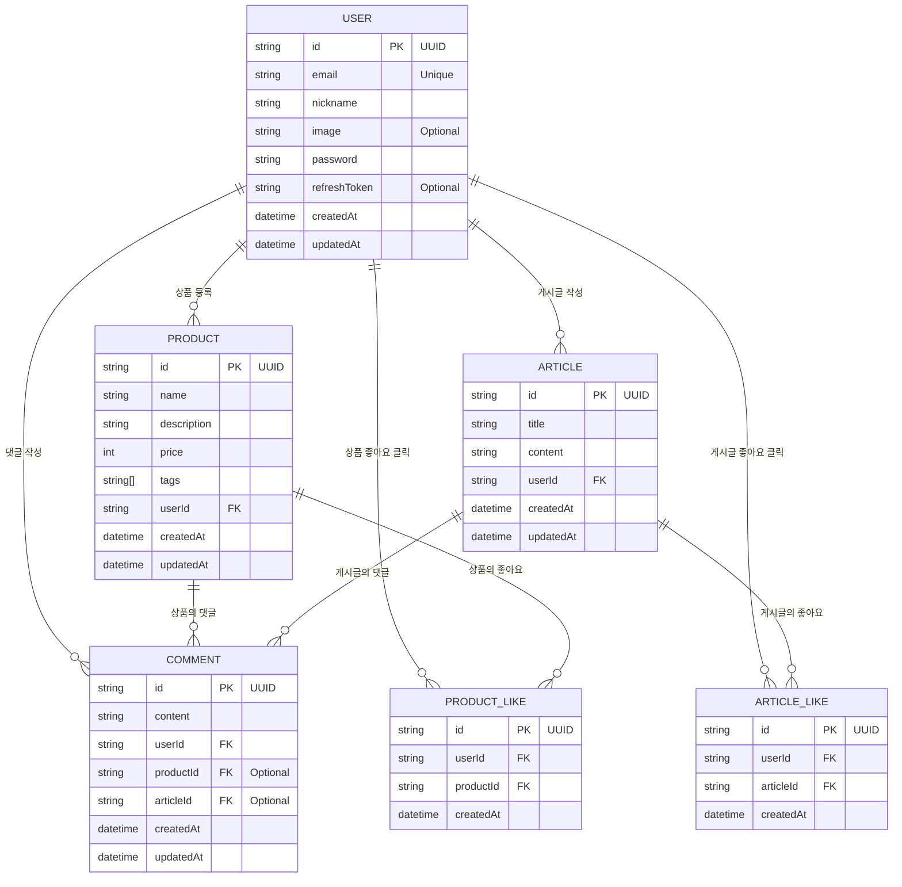

# 미션 ERD

## Entity Relationship Diagram

```mermaid
erDiagram
    USER {
        string id PK "UUID"
        string email "Unique"
        string nickname
        string image "Optional"
        string password
        string refreshToken "Optional"
        datetime createdAt
        datetime updatedAt
    }

    PRODUCT {
        string id PK "UUID"
        string name
        string description
        int price
        string[] tags
        string userId FK
        datetime createdAt
        datetime updatedAt
    }

    ARTICLE {
        string id PK "UUID"
        string title
        string content
        string userId FK
        datetime createdAt
        datetime updatedAt
    }

    COMMENT {
        string id PK "UUID"
        string content
        string userId FK
        string productId FK "Optional"
        string articleId FK "Optional"
        datetime createdAt
        datetime updatedAt
    }

    PRODUCT_LIKE {
        string id PK "UUID"
        string userId FK
        string productId FK
        datetime createdAt
    }

    ARTICLE_LIKE {
        string id PK "UUID"
        string userId FK
        string articleId FK
        datetime createdAt
    }

    %% Relationships
    %% 1. USER Relationships
    USER ||--o{ PRODUCT : "상품 등록"
    USER ||--o{ ARTICLE : "게시글 작성"
    USER ||--o{ COMMENT : "댓글 작성"
    USER ||--o{ PRODUCT_LIKE : "상품 좋아요 클릭"
    USER ||--o{ ARTICLE_LIKE : "게시글 좋아요 클릭"

    %% 2. PRODUCT Relationships
    PRODUCT ||--o{ COMMENT : "상품의 댓글"
    PRODUCT ||--o{ PRODUCT_LIKE : "상품의 좋아요"

    %% 3. ARTICLE Relationships
    ARTICLE ||--o{ COMMENT : "게시글의 댓글"
    ARTICLE ||--o{ ARTICLE_LIKE : "게시글의 좋아요"
```
