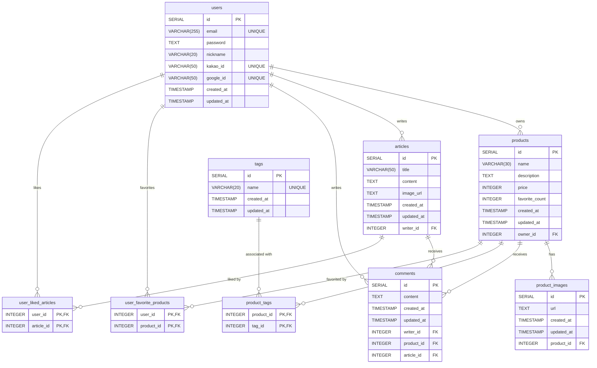

```mermaid
erDiagram
users {
SERIAL id PK
VARCHAR(255) email "UNIQUE"
TEXT password
VARCHAR(20) nickname
VARCHAR(50) kakao_id "UNIQUE"
VARCHAR(50) google_id "UNIQUE"
TIMESTAMP created_at
TIMESTAMP updated_at
}

    products {
        SERIAL id PK
        VARCHAR(30) name
        TEXT description
        INTEGER price
        INTEGER favorite_count
        TIMESTAMP created_at
        TIMESTAMP updated_at
        INTEGER owner_id FK
    }

    articles {
        SERIAL id PK
        VARCHAR(50) title
        TEXT content
        TEXT image_url
        TIMESTAMP created_at
        TIMESTAMP updated_at
        INTEGER writer_id FK
    }

    tags {
        SERIAL id PK
        VARCHAR(20) name "UNIQUE"
        TIMESTAMP created_at
        TIMESTAMP updated_at
    }

    comments {
        SERIAL id PK
        TEXT content
        TIMESTAMP created_at
        TIMESTAMP updated_at
        INTEGER writer_id FK
        INTEGER product_id FK
        INTEGER article_id FK
    }

    product_images {
        SERIAL id PK
        TEXT url
        TIMESTAMP created_at
        TIMESTAMP updated_at
        INTEGER product_id FK
    }

    product_tags {
        INTEGER product_id PK, FK
        INTEGER tag_id PK, FK
    }

    user_favorite_products {
        INTEGER user_id PK, FK
        INTEGER product_id PK, FK
    }

    user_liked_articles {
        INTEGER user_id PK, FK
        INTEGER article_id PK, FK
    }

    users ||--o{ products : "owns"
    users ||--o{ articles : "writes"
    users ||--o{ comments : "writes"
    products ||--o{ product_images : "has"
    products ||--o{ comments : "receives"
    articles ||--o{ comments : "receives"
    tags ||--o{ product_tags : "associated with"
    products ||--o{ product_tags : "tagged with"
    users ||--o{ user_favorite_products : "favorites"
    products ||--o{ user_favorite_products : "favorited by"
    users ||--o{ user_liked_articles : "likes"
    articles ||--o{ user_liked_articles : "liked by"

```
