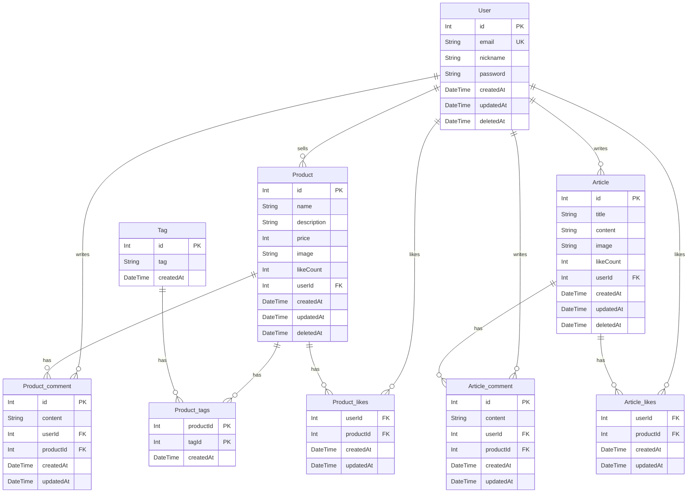

# PandaMarket ERD (Entity Relationship Diagram)

## ERD 구조 생성

## 관계 설명

| 테이블                    | 관계 | 설명                                                    |
| ------------------------- | ---- | ------------------------------------------------------- |
| User → Product            | 1:N  | 사용자는 여러 제품을 등록할 수 있음                     |
| User → Product_comment    | 1:N  | 사용자는 제품의 여러 댓글을 등록할 수 있음              |
| User → Product_likes      | 1:N  | 사용자는 여러 제품을 "좋아요" 할 수 있음                |
| User → Article            | 1:N  | 사용자는 여러 게시글을 작성할 수 있음                   |
| User → Article_comment    | 1:N  | 사용자는 게시글의 여러 댓글을 작성할 수 있음            |
| User → Article_likes      | 1:N  | 사용자는 여러 게시글을 "좋아요" 할 수 있음              |
| Product ↔ Tag             | N:M  | 중간 테이블 Product_tags를 사용해 서로 다중 관계를 가짐 |
| Product → Product_comment | 1:N  | 제품은 여러 개의 댓글을 가질 수 있음                    |
| Product → Product_likes   | 1:N  | 제품은 여러 개의 "좋아요"를 가질 수 있음                |
| Article → Article_comment | 1:N  | 게시글은 여러 개의 댓글을 가질 수 있음                  |
| Article → Article_likes   | 1:N  | 게시글은 여러 개의 "좋아요"를 가질 수 있음              |

## 특이사항

- 큰 카테고리로 User / Product / Article 구조를 가지고 해당 구조에서 각각 사용하는 하위 테이블인 comment / likes / tag 를 생성
