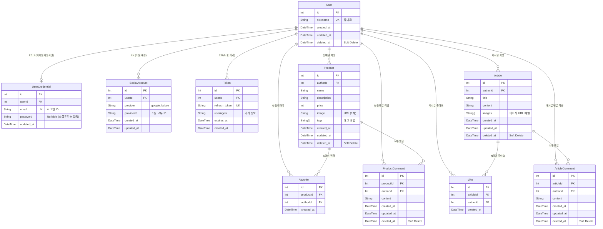

```mermaid
erDiagram

    User {
        Int id PK
        String nickname UK "유니크"
        DateTime created_at
        DateTime updated_at
        DateTime deleted_at "Soft Delete"
    }

    UserCredential {
        Int id PK
        Int userId FK
        String email UK "로그인 ID"
        String password "Nullable (소셜유저는 없음)"
        DateTime updated_at
    }

    SocialAccount {
        Int id PK
        Int userId FK
        String provider "google, kakao"
        String providerId "소셜 고유 ID"
        DateTime created_at
        DateTime updated_at
    }

    Token {
        Int id PK
        Int userId FK
        String refresh_token UK
        String userAgent "기기 정보"
        DateTime expires_at
        DateTime created_at
    }

    Product {
        Int id PK
        Int authorId FK
        String name
        String description
        Int price
        String image "URL (1개)"
        String[] tags "태그 배열"
        DateTime created_at
        DateTime updated_at
        DateTime deleted_at "Soft Delete"
    }

    Favorite {
        Int id PK
        Int productId FK
        Int authorId FK
        DateTime created_at
    }

    ProductComment {
        Int id PK
        Int productId FK
        Int authorId FK
        String content
        DateTime created_at
        DateTime updated_at
        DateTime deleted_at "Soft Delete"
    }

    Article {
        Int id PK
        Int authorId FK
        String title
        String content
        String[] images "이미지 URL 배열"
        DateTime created_at
        DateTime updated_at
        DateTime deleted_at "Soft Delete"
    }

    Like {
        Int id PK
        Int articleId FK
        Int authorId FK
        DateTime created_at
    }

    ArticleComment {
        Int id PK
        Int articleId FK
        Int authorId FK
        String content
        DateTime created_at
        DateTime updated_at
        DateTime deleted_at "Soft Delete"
    }

    %% 유저 - 인증
    User ||--o| UserCredential : "1:0..1 (이메일 사용자만)"
    User ||--o{ SocialAccount : "1:N (소셜 계정)"
    User ||--o{ Token : "1:N (다중 기기)"

    %% 유저 - 작성 활동
    User ||--o{ Product : "판매글 작성"
    User ||--o{ ProductComment : "상품 댓글 작성"
    User ||--o{ Favorite : "상품 찜하기"

    User ||--o{ Article : "게시글 작성"
    User ||--o{ ArticleComment : "게시글 댓글 작성"
    User ||--o{ Like : "게시글 좋아요"

    %% 상품 관계
    Product ||--o{ Favorite : "N명이 찜함"
    Product ||--o{ ProductComment : "N개 댓글"

    %% 게시글 관계
    Article ||--o{ Like : "N명이 좋아요"
    Article ||--o{ ArticleComment : "N개 댓글"
```
